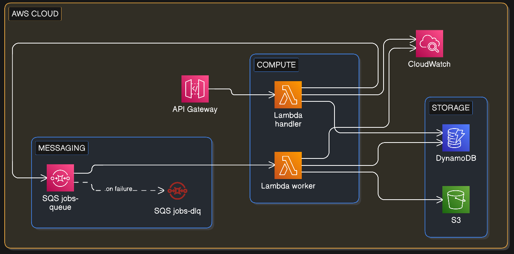
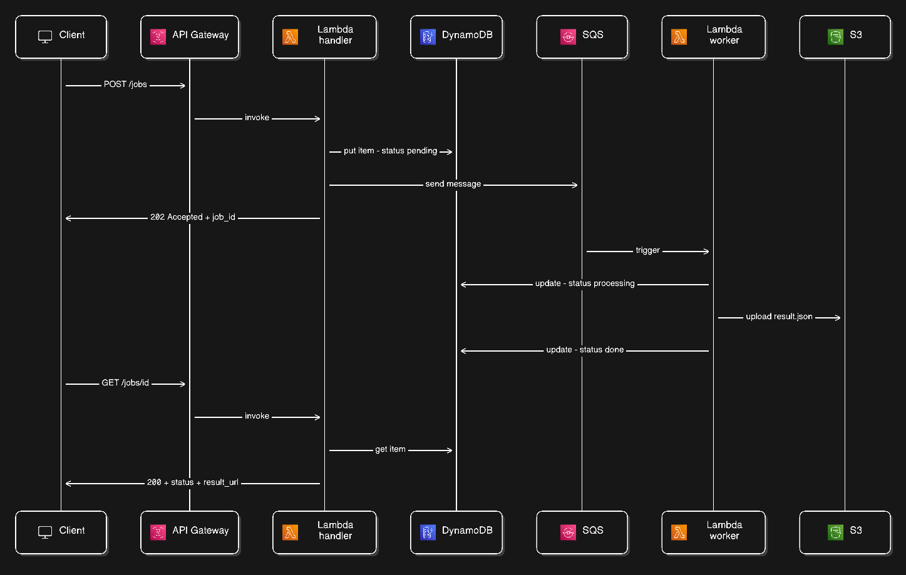

# Async Job Processing API

A serverless backend API built on AWS that demonstrates asynchronous job processing using an event-driven architecture (EDA).

## Architecture
```
POST /jobs
  → API Gateway → Lambda (api-handler) → DynamoDB (pending) → SQS
  → returns 202 immediately

SQS → Lambda (job-worker) → processes job → S3 → DynamoDB (done)

GET /jobs/{id}
  → API Gateway → Lambda (api-handler) → DynamoDB → returns status
```

## AWS Services

| Service | Role |
|---|---|
| API Gateway | HTTP entry point |
| Lambda (api-handler) | Handles POST /jobs and GET /jobs/{id} |
| Lambda (job-worker) | SQS consumer, processes jobs |
| SQS | Decouples producer from consumer |
| DynamoDB | Persists job status and metadata |
| S3 | Stores job results, generates presigned URLs |

## Architecture

### AWS Services


### Request Flow


## Tech Stack

- Python 3.12
- AWS SAM IaC (Infrastructure as Code)
- boto3

## Prerequisites

- AWS CLI configured
- SAM CLI installed
- Python 3.12

## Deploy
```bash
sam build && sam deploy --guided
```

## API Usage

> Note: Replace `{api-url}` with the actual API Gateway endpoint from the deployment output.

### Create a job
```bash
curl -X POST https://{api-url}/Prod/jobs \
  -H "Content-Type: application/json" \
  -d '{"type": "sales_report", "data": {"user_id": "usr_123", "period": "2024-Q4"}}'
```

Response `202 Accepted`:
```json
{
  "job_id": "9bf0b9f4-83f2-4ab2-9893-966c707fc56d",
  "status": "pending"
}
```

### Check job status
```bash
curl https://{api-url}/Prod/jobs/{job_id}
```

Response `200 OK` (done):
```json
{
  "job_id": "9bf0b9f4-83f2-4ab2-9893-966c707fc56d",
  "status": "done",
  "result_url": "https://s3.amazonaws.com/...",
  "created_at": "2026-03-24T23:06:59Z",
  "updated_at": "2026-03-24T23:07:05Z"
}
```

## Project Structure
```
asyncjobs/
├── template.yaml              # SAM infrastructure definition
├── src/
│   ├── api_handler/
│   │   ├── handler.py         # Lambda entry point
│   │   ├── jobs.py            # Business logic
│   │   ├── clients.py         # boto3 clients
│   │   ├── models.py          # TypedDict models
│   │   └── requirements.txt
│   └── job_worker/
│       ├── handler.py         # Lambda entry point
│       ├── worker.py          # Job processing logic
│       ├── clients.py         # boto3 clients
│       └── requirements.txt
└── events/                    # SAM local test events
    ├── post_job.json
    └── get_job.json
```

## Cleanup
```bash
# empty S3 bucket first
aws s3 rm s3://{bucket-name} --recursive

# delete the stack
aws cloudformation delete-stack --stack-name asyncjobs
```
